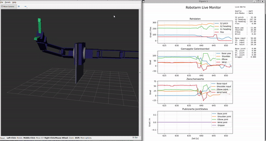

# IMU Robotic Arm

Dieses Repository beschreibt und pflegt den aktuellen Prototyp eines IMU-gesteuerten 5-DOF-Roboterarms auf Basis eines Adeept-Arms.
Das Projekt wird unter Windows und WSL entwickelt und trennt bewusst zwischen Vorbereitung, Security, Hardware, Kalibrierung, Firmware, digitalen Zwillingen und Tests.

## Lizenz

Die projekt-eigenen Inhalte dieses Repositories stehen unter **Apache License 2.0**.
Die verbindliche Lizenz steht in `LICENSE.md`.
Sicherheits- und Einsatzhinweise stehen getrennt in `SAFETY_NOTICE.md`.
Hersteller- und Drittmaterialien, insbesondere unter `official_downloads/`, bleiben zusaetzlich ihren eigenen Rechten und Hinweisen unterworfen.

## Projektziel

Gebaut wird ein Roboterarm, der Bewegungen des menschlichen Arms ueber mehrere BNO055-IMUs und eine Potentiometer-basierte Greifer-Eingabe in Gelenkzielwerte uebersetzt.
Der sicherheitskritische Steuerpfad bleibt lokal: `ESP-NOW` zwischen den ESP32, `I2C` zum Arduino, kein WLAN und keine Cloud im eigentlichen Bewegungsweg.
WiFi wird ausschliesslich fuer die beobachtende Debug-Bridge zum Pi, das Dashboard und den ROS-2-Digital-Twin genutzt.

## Demo

### ROS-2-Digital-Twin



### Wearable plus Dashboard


## Aktueller Fokus

Die aktuelle Phase konzentriert sich auf:

- reale Safety- und Security-Freigabe auf Basis des bereits verifizierten Digital-Twin-Pfads nachziehen
- Stock-/Learning-Mode des originalen Adeept-Kits sauber dokumentieren und gegen den modifizierten Projektstand abgrenzen
- Prototyp-, Verkabelungs- und Messnachweise fuer den aktuellen Perfboard-/Wearable-Stand konsistent pflegen

Abgeschlossen (Stand 2026-04-24):

- Toolchain vollstaendig eingerichtet: Arduino IDE 3.3.7 als Hauptumgebung, PlatformIO als lokaler Fallback
- 3x BNO055 ueber PCA9548A-Mux validiert, Kalibrierungsoffsets im NVS persistent
- Greifer-Eingabe auf Potentiometer aus Robustheitsgruenden umgestellt; aktueller 2-Draht-Arbeitsstand auf `GPIO1`
- `ImuPaket v4` per ESP-NOW Unicast: drei IMUs, Kalibrierungsstatus, Notaus-Flag, XOR-Pruefsumme, Frische-Check
- BNO055-Kalibrierungspersistenz im NVS mit Einzelkalibrierung (CAL0/CAL1/CAL2)
- LED-Schema invertiert (aus=OK, an=Problem) mit RGB GPIO48 als FAULT auf allen ESPs
- Live-Sensorausfallerkennung fuer IMUs und Greifer-Eingabe
- Multi-Peer ESP-NOW: Controller sendet an Receiver (Steuerpfad) und Bridge (Debug-Pfad)
- Bridge-ESP32: ESP-NOW Empfang → WiFi/MQTT → Mosquitto (Pi) mit OTA und Passwort-Auth
- WiFi-Kanal 1 auf allen ESPs fuer ESP-NOW/WiFi-Koexistenz
- MQTT MCP Server fuer Claude Live-Sensorzugriff (6 Tools)
- Kompletter Datenpfad validiert: Controller → ESP-NOW → Bridge → MQTT → Pi → MCP → Claude
- Secret-Scanner mit 10 Kategorien, Pre-Commit/Pre-Push Hooks, GitHub Actions
- Notaus-Schalter (Emergency Stop): Toggle-Button an GPIO21, jeder Tastendruck toggelt Notaus, propagiert per ImuPaket v4 an Receiver und Bridge
- Controller auf Lochraster/Perfboard ueberfuehrt und der aktuelle Arm-Prototyp mechanisch fertig aufgebaut
- I2C-Kette Receiver → Arduino bench-validiert: ESP32 GPIO13/14 (SDA/SCL) → Arduino A4/A5 (TWI), Frame V1 (11 Bytes) ueber I2C statt UART, Servos dauerhaft attached bei 50Hz, ISR-minimales Design, Slew-Rate-Limiter (50 Grad/s)
- Servo-Limits empirisch kalibriert und alle 5 Achsen (Basis, Schulter, Ellbogen, Handgelenk, Greifer) per I2C-Sweep getestet
- Dashboard-Digital-Twin mit aktueller Gelenkabbildung: Basis ueber `S2.pitch`, Schulter ueber `S2.heading`, Ellbogen ueber relative Heading-Differenz `S1` zu `S2`, Wrist ueber relativen Twist `S0` zu `S1`, Greifer ueber `f`
- ROS 2 Jazzy Package `robotarm_description` erweitert: Wandmontage, Live-MQTT, Recorder, Replay, Plot, Live-Monitor und `target_arm`-Modi verifiziert

## Leitdokumente

Vor groesseren Aenderungen sind besonders relevant:

- `README.md` als Einstieg
- `CLAUDE.md` als kurzer KI-Brief
- `PROJEKT_ABLAUFPLAN.md` fuer die Reihenfolge der Projektphasen
- `PROJEKT_FORTSCHRITT.md` fuer den aktuellen Projektstand
- `GLOBAL_RULES.md` fuer Entwicklungs- und Dokumentationsregeln
- `ARCHITECTURE.md` fuer Systemgrenzen und Datenfluss
- `SYSTEM_FRAMEWORKS.md` fuer feste Subsysteme und Verantwortungen
- `COMMUNICATION_FRAMEWORK.md` fuer `ESP-NOW`-, Paket- und I2C-Regeln
- `SECURITY_FRAMEWORK.md` fuer Security-Grundsaetze
- `CALIBRATION_FRAMEWORK.md` fuer Nullpunkt-, Referenz- und Mappingregeln
- `SAFETY_FRAMEWORK.md` fuer Limits, Watchdog, Neutralposition und Freigaben
- `preparation/README.md`, `security/README.md`, `hardware/README.md`, `firmware/README.md`, `tests/README.md`, `docs/README.md` und `future/README.md` fuer lokale Arbeitsbereiche
- `hardware/ADEEPT_ARM_PRODUCT_BASELINE.md` fuer die konkrete Produktbasis des vorhandenen Adeept-Kits
- `hardware/electronics/POWER_SUPPLY_CONCEPT.md` fuer die Stromversorgungsstrategie von Stock-Test, Bench und spaeterem Projektbetrieb
- `official_downloads/README.md` fuer den importierten offiziellen Herstellerstand
- `ros2/QUICKSTART.md` fuer den Schnellstart des ROS 2 Jazzy Workspace
- `LICENSE.md` fuer die Apache-2.0-Lizenz der projekt-eigenen Inhalte
- `SAFETY_NOTICE.md` fuer die getrennten Sicherheits- und Einsatzhinweise

## Wichtige Befehle

Dokumentation sammeln und aktualisieren:

```bash
bash ./scripts/update_docs.sh
```

## Dokumentationsprinzip

Jeder relevante Ordner besitzt mindestens eine eigene `README.md`.
Groessere Unterprojekte besitzen zusaetzlich eine eigene `ROADMAP.md`.
Der Ordner `documentation/` ist ein automatisch erzeugter Snapshot und keine manuell gepflegte Quelldokumentation.
Der Ordner `docs/` bleibt die manuell gepflegte Arbeits- und Nachweisdokumentation.
Der Snapshot unter `documentation/` sammelt die projektgepflegte Markdown-Dokumentation plus ausgewaehlte README-relevante Medien; Vendor-Archive unter `official_downloads/raw/` und `official_downloads/extracted/` bleiben bewusst ausserhalb dieses Verwaltungsstands.
Forschungs-, Konzept- und Entscheidungsdokumente muessen die verwendeten externen Quellen in einem eigenen Abschnitt `Recherchequellen` auffuehren.
Nicht-repotaugliche lokale Werte wie Schluessel, Peer-Listen, lokale Identitaetsdaten, API-Schluessel und absolute Dateipfade (z.B. `/home/username/`, `/mnt/c/Users/username/`) gehoeren nach `security/local/` oder in gitignorierte `*.local.*`-Konfigurationsdateien und duerfen niemals eingecheckt werden.

## Aktueller Entwicklungsstand

Dokumentations- und Prozessbasis ist angelegt und wird nach jedem Meilenstein synchronisiert.
Toolchain steht: Arduino IDE 3.3.7 als Hauptumgebung, PlatformIO als Fallback.
Sensorpfad fuer den Digital Twin ist stabil: drei BNO055 ueber PCA9548A-Mux plus Potentiometer-basierte Greifer-Eingabe auf `GPIO1`.
Kommunikation: Controller sendet per ESP-NOW an Receiver (Steuerpfad) und Bridge (Debug-Pfad) gleichzeitig auf Kanal 1.
Debug-Infrastruktur: Bridge-ESP32 leitet Daten per WiFi/MQTT an Mosquitto (Pi); MQTT MCP Server, Dashboard und ROS lesen denselben Strom mit.
LED-Schema invertiert (aus=OK, an=Problem) mit RGB GPIO48 als FAULT auf allen ESPs.
Secret-Scanner mit 10 Kategorien und automatischen Git-Hooks schuetzt vor versehentlichem Secret-Push.
I2C-Kette Receiver → Arduino bench-validiert: Frame V1 (11 Bytes) ueber I2C (ESP32 GPIO13/14 → Arduino A4/A5), Servos dauerhaft attached bei 50Hz, ISR-minimales Design, Slew-Rate-Limiter.
Die Security-Baseline wird bewusst erst nach erster I2C-Grundkette aktiviert.
Dashboard und ROS 2 bilden aktuell denselben Gelenkstand als Digital Twin ab; die Dashboard-Kollisionslogik bleibt fuer reines Mapping-Debug absichtlich deaktiviert.
Der aktuelle Prototyp ist mechanisch aufgebaut, der Controller sitzt auf Lochraster/Perfboard, und die Debug-Bridge wurde end-to-end im Live-Betrieb verifiziert.
Naechste Schritte: reale Safety-/Security-Freigabe, Stock-/Learning-Mode sauber dokumentieren und den bestaetigten Digital-Twin-Pfad kontrolliert in die reale Armfreigabe ueberfuehren.
