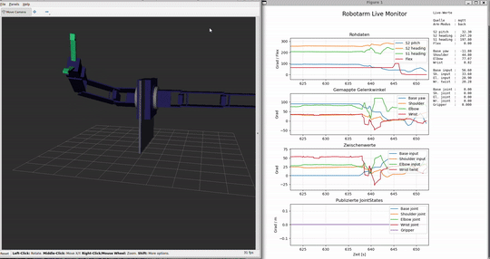
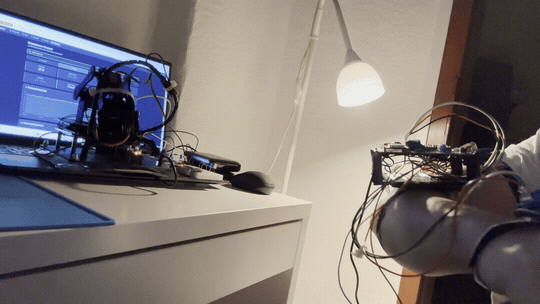

<a id="top"></a>

<div align="center">

[](#deutsch)
[](#english)

</div>

---

<a id="deutsch"></a>

<a id="imu-robotic-arm"></a>

# IMU Robotic Arm

Ein tragbarer Controller uebertraegt Armbewegungen auf einen modifizierten
Adeept-5-DOF-Roboterarm. Drei `BNO055`-IMUs erfassen Hand, Unterarm und Oberarm;
ein Potentiometer steuert den Greifer.

Der Prototyp besitzt zwei bewusst getrennte Datenpfade:

```text
Realer Steuerpfad
3x BNO055 + Potentiometer
  -> ESP32-S3 Controller
  -> ESP-NOW, Kanal 1
  -> ESP32-S3 Receiver
  -> I2C, Slave 0x42
  -> Arduino-kompatibles ATmega328P-Board
  -> 5 Servos

Debug- und Twin-Pfad
ESP32-S3 Controller
  -> zweiter ESP-NOW-Peer
  -> ESP32-S3 Bridge
  -> WiFi / MQTT / Raspberry Pi
  -> Dashboard, MCP und ROS 2
```

Der Debug-/Twin-Stack ist ein aktiver Bestandteil des Projekts. Er beobachtet
und visualisiert den Sensorstrom, liegt aber nicht im realen Servo-Steuerpfad.

<a id="de-demos"></a>

## Demos

### ROS-2-Digital-Twin



### Finaler Prototyp



<a id="de-aktueller-stand"></a>

## Aktueller Stand

- Der vollstaendige Funk- und `I2C`-Pfad wurde am realen Prototyp getestet.
- Der eingecheckte Receiver startet weiterhin im `I2C`-Test-Sweep. Dieser Modus
  bewegt den Arm automatisch und ist keine Safety-Freigabe.
- `Live-I2C` und alle Live-Achsen bleiben im Repo-Default deaktiviert und werden
  nur bewusst per Compile-Flags aktiviert.
- Controller, Receiver-Default, Receiver-Live und Arduino-Sketch wurden mit den
  in [docs/BUILD.md](docs/BUILD.md#deutsch) festgehaltenen Versionen kompiliert.
- Bridge, `MQTT`, Dashboard, `MCP` und `ROS 2` bilden den aktiven Debug-/Twin-Pfad.
- Der Prototyp besitzt keine formale Produktiv-, Safety- oder Security-Freigabe.

Wichtig: Das Mapping des realen Arms und das Mapping der digitalen Zwillinge
sind derzeit nicht identisch. Die jeweiligen Implementierungen und Grenzen
sind in [docs/PROTOCOL.md](docs/PROTOCOL.md#deutsch) dokumentiert.

<a id="de-repository"></a>

## Repository

- `firmware/`: aktive Controller-, Receiver-, Bridge- und Arduino-Firmware
- `firmware/archive/`: historische ESP-NOW-, UART- und Bring-up-Sketches
- `dashboard/`: Web-Dashboard und MQTT-MCP-Werkzeuge
- `ros2/`: ROS-2-Digital-Twin, Live-Monitor, Recorder und Replay
- `calibration/`: aktuelle Sensor-, Referenz- und Mappingdaten
- `docs/`: Hardware-, Protokoll-, Build- und Testdokumentation
- `tests/`: statische Guards fuer zeitkritische Firmwarepfade
- `scripts/`: lokale Pflege-, Sync- und Secret-Scan-Helfer
- `official_downloads/`: Herstellerlinks und Herkunftshinweise, kein Build-Input

<a id="de-einstieg"></a>

## Einstieg

1. [docs/BUILD.md](docs/BUILD.md#deutsch) fuer Toolchain, Abhaengigkeiten und Builds
2. [docs/HARDWARE.md](docs/HARDWARE.md#deutsch) fuer Pins, Verdrahtung und Servolimits
3. [docs/PROTOCOL.md](docs/PROTOCOL.md#deutsch) fuer Steuer- und Debugdatenpfade
4. [calibration/README.md](calibration/README.md) fuer Referenzpose und Mapping
5. [SAFETY.md](SAFETY.md#deutsch) vor jeder Bewegung am realen Arm
6. [SECURITY.md](SECURITY.md#deutsch) vor Netz-, MQTT-, MCP- oder OTA-Betrieb
7. [docs/TESTING.md](docs/TESTING.md#deutsch) fuer bestaetigte und noch offene Nachweise
8. [dashboard/README.md](dashboard/README.md) und [ros2/README.md](ros2/README.md)
   fuer den Debug-/Twin-Stack

<a id="de-sicherheitsgrenze"></a>

## Sicherheitsgrenze

Der Taster an `GPIO21` ist ein Software-Notaus-Request. Er trennt weder die
Servoversorgung noch das Drehmoment und ist kein fail-safe Hardware-Notaus.
Timeout- und Neutralverhalten fahren Zielwerte ueber die vorhandene
Slew-Begrenzung an. Details stehen in [SAFETY.md](SAFETY.md#deutsch).

<a id="de-lokale-konfiguration"></a>

## Lokale Konfiguration

Echte MAC-Adressen, WLAN-/MQTT-Zugangsdaten, Schluessel und lokale Pfade werden
nicht eingecheckt. Fuer Controller und Bridge existieren Templates; lokale
Dateien enden auf `*.local.*` und bleiben durch `.gitignore` ausgeschlossen.

Vor einem Push:

```bash
tr -d '\r' < scripts/secret_scan.sh | bash -s -- --tracked
```

<a id="de-lizenz"></a>

## Lizenz

Projekt-eigene Inhalte stehen unter der [Apache License 2.0](LICENSE.md).
Verlinktes Hersteller- und Drittmaterial behaelt seine jeweiligen Lizenz- und
Urheberrechtsbedingungen.

<div align="center">

[](#top)

</div>

---

<a id="english"></a>

<a id="imu-robotic-arm-english"></a>

# IMU Robotic Arm

A wearable controller transfers arm movements to a modified Adeept 5-DOF
robotic arm. Three `BNO055` IMUs track the hand, forearm, and upper arm; a
potentiometer controls the gripper.

The prototype has two deliberately separated data paths:

```text
Real control path
3x BNO055 + potentiometer
  -> ESP32-S3 controller
  -> ESP-NOW, channel 1
  -> ESP32-S3 receiver
  -> I2C, slave 0x42
  -> Arduino-compatible ATmega328P board
  -> 5 servos

Debug and digital-twin path
ESP32-S3 controller
  -> second ESP-NOW peer
  -> ESP32-S3 bridge
  -> WiFi / MQTT / Raspberry Pi
  -> dashboard, MCP, and ROS 2
```

The debug/digital-twin stack is an active part of the project. It observes and
visualizes the sensor stream, but it is not part of the real servo-control path.

<a id="en-demos"></a>

## Demos

### ROS 2 Digital Twin


### Final Prototype


<a id="en-current-status"></a>

## Current Status

- The complete radio and `I2C` path has been tested on the real prototype.
- The committed receiver still starts in the `I2C` test sweep. This mode moves
  the arm automatically and is not a safety approval.
- `Live I2C` and all live axes remain disabled in the repository defaults and
  are enabled deliberately through compile flags only.
- The controller, receiver default, receiver live configuration, and Arduino
  sketch were compiled with the versions recorded in [docs/BUILD.md](docs/BUILD.md#english).
- The bridge, `MQTT`, dashboard, `MCP`, and `ROS 2` form the active debug/digital-twin path.
- The prototype has no formal production, safety, or security approval.

Important: The real-arm mapping and the digital-twin mapping are currently not
identical. Their respective implementations and limitations are documented in
[docs/PROTOCOL.md](docs/PROTOCOL.md#english).

<a id="en-repository"></a>

## Repository

- `firmware/`: active controller, receiver, bridge, and Arduino firmware
- `firmware/archive/`: historical ESP-NOW, UART, and bring-up sketches
- `dashboard/`: web dashboard and MQTT MCP tools
- `ros2/`: ROS 2 digital twin, live monitor, recorder, and replay
- `calibration/`: current sensor, reference, and mapping data
- `docs/`: hardware, protocol, build, and test documentation
- `tests/`: static guards for time-critical firmware paths
- `scripts/`: local maintenance, synchronization, and secret-scan helpers
- `official_downloads/`: manufacturer links and provenance notes, not a build input

<a id="en-getting-started"></a>

## Getting Started

1. [docs/BUILD.md](docs/BUILD.md#english) for the toolchain, dependencies, and builds
2. [docs/HARDWARE.md](docs/HARDWARE.md#english) for pins, wiring, and servo limits
3. [docs/PROTOCOL.md](docs/PROTOCOL.md#english) for control and debug data paths
4. [calibration/README.md](calibration/README.md) for the reference pose and mapping
5. [SAFETY.md](SAFETY.md#english) before moving the real arm
6. [SECURITY.md](SECURITY.md#english) before operating networking, MQTT, MCP, or OTA
7. [docs/TESTING.md](docs/TESTING.md#english) for confirmed and outstanding evidence
8. [dashboard/README.md](dashboard/README.md) and [ros2/README.md](ros2/README.md)
   for the debug/digital-twin stack

<a id="en-safety-boundary"></a>

## Safety Boundary

The button on `GPIO21` is a software emergency-stop request. It disconnects
neither servo power nor torque and is not a fail-safe hardware emergency stop.
Timeout and neutral behavior approach their targets through the existing slew
limit. See [SAFETY.md](SAFETY.md#english) for details.

<a id="en-local-configuration"></a>

## Local Configuration

Real MAC addresses, WiFi/MQTT credentials, keys, and local paths are not
committed. Templates are available for the controller and bridge; local files
end in `*.local.*` and remain excluded through `.gitignore`.

Before pushing:

```bash
tr -d '\r' < scripts/secret_scan.sh | bash -s -- --tracked
```

<a id="en-license"></a>

## License

Project-owned content is available under the [Apache License 2.0](LICENSE.md).
Linked manufacturer and third-party material retains its respective licensing
and copyright terms.

<div align="center">

[](#top)

</div>
