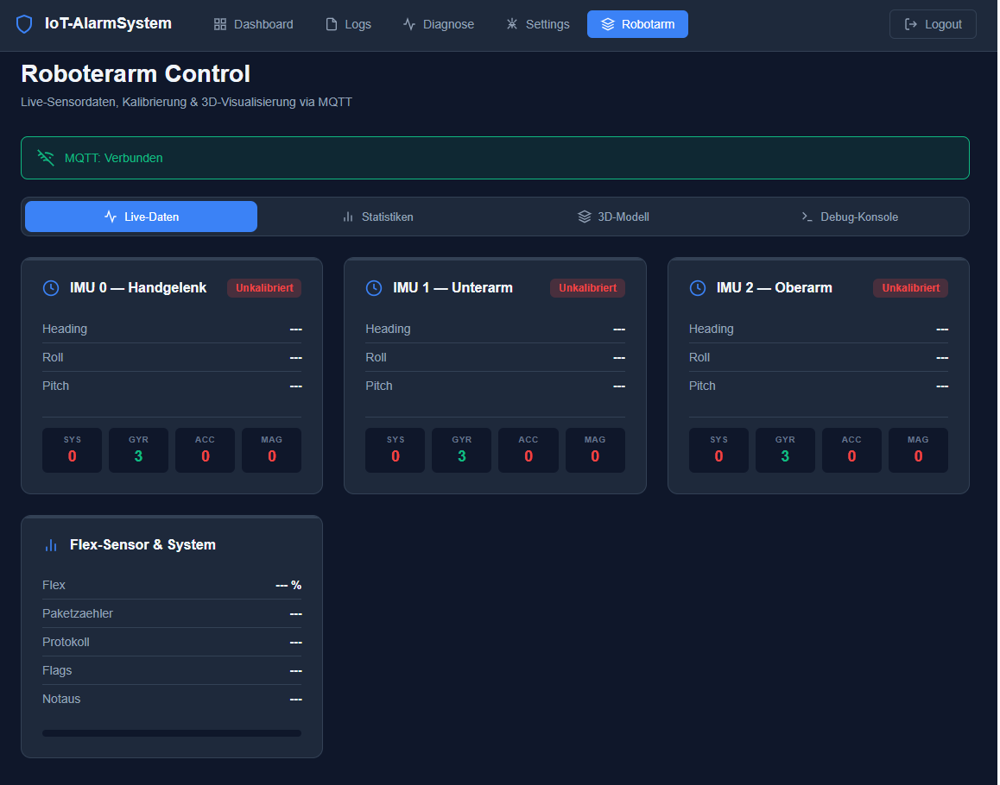
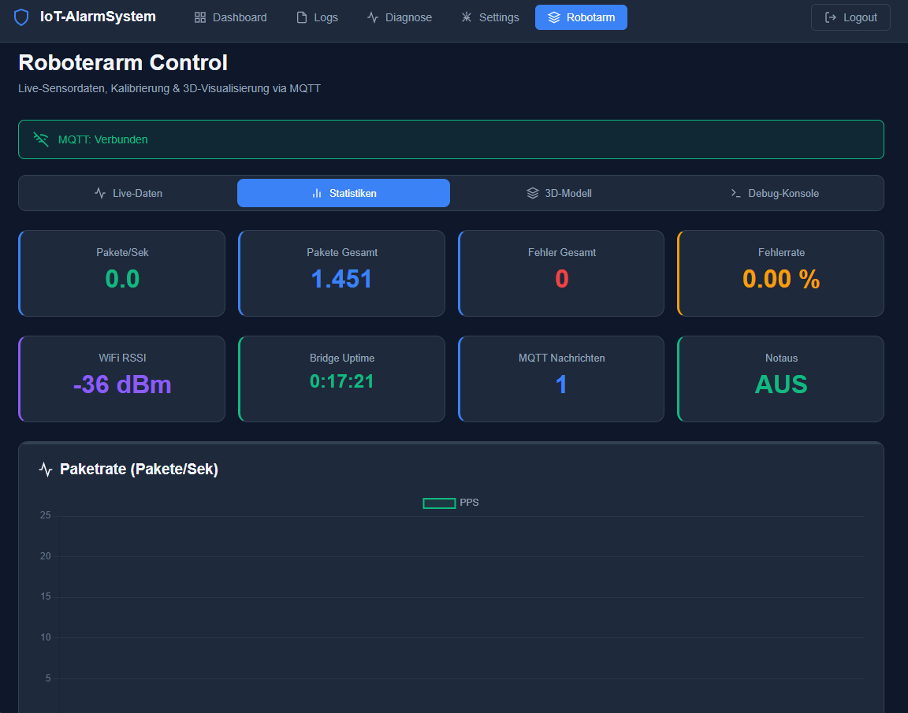
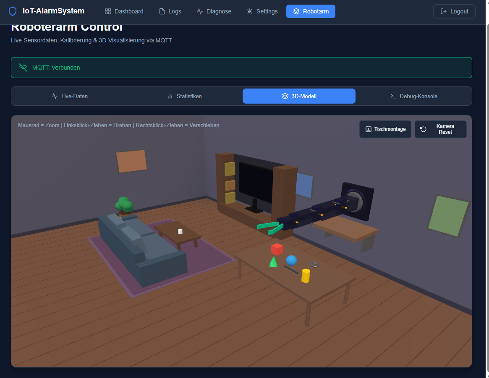
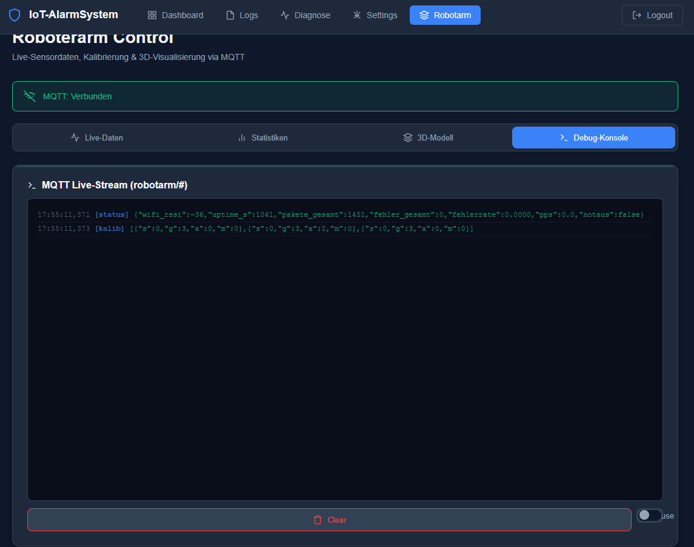

# dashboard

## Zweck

Dieses Verzeichnis enthaelt die Browser- und MQTT-Werkzeuge fuer den digitalen Zwilling des Roboterarms auf dem Pi.
Das Dashboard ist ein reines Entwicklungs- und Debugwerkzeug: Es beobachtet Live-Daten, visualisiert Mapping und hilft beim Tuning, sendet aber keine Bewegungsbefehle in den Steuerpfad.

## Aktueller Stand

Die Dashboard-Erweiterung ist produktiv auf dem Pi im Einsatz und gegen den aktuellen Prototypstand synchronisiert:

- `robotarm`-Tab mit Live-Daten, Statistik, 3D-Twin und Debug-Konsole
- MQTT-WebSocket-Pfad ueber Mosquitto und Nginx verifiziert
- Mapping des realen Prototyps auf den Twin fuer Basis, Schulter, Ellenbogen, Wrist und Greifer
- Greifer-Eingabe aktuell als Potentiometer aus Robustheitsgruenden; im Protokoll bleibt das Feld `f` aus Rueckwaertskompatibilitaet erhalten
- Dashboard-Kollisionssolver ist fuer das aktuelle Feintuning absichtlich deaktiviert, weil das direkte Mapping sonst Schulter und Ellenbogen verfremdet
- Bridge-, Dashboard- und ROS-Debugpfad wurden end-to-end verifiziert

## Screenshots

### Live-Daten
IMU-Sensorkarten mit Heading, Roll, Pitch, Kalibrierungsstatus und Greifer-Prozentwert.

### Statistiken
Paketrate, Fehlerrate, WiFi RSSI, Bridge Uptime und Live-Charts.

### 3D-Modell
Three.js-Twin des Adeept-Arms in der Wandmontage-Szene.

### Debug-Konsole
MQTT-Livestream aller `robotarm/#`-Topics als Roh-JSON.

## Inhalt

- `DASHBOARD_CONCEPT.md` beschreibt Architektur, Datenpfad und Twin-Mapping
- `ROADMAP.md` haelt offene Dashboard-Arbeitspakete fest
- `web/` enthaelt die Dateien, die auf den Pi deployed werden
  - `web/views/robotarm.php` fuer den Robotarm-Tab
  - `web/js/robotarm.js` fuer MQTT, Live-Daten und Charts
  - `web/js/robotarm_3d.js` fuer den 3D-Twin und das Gelenkmapping
  - `web/css/robotarm.css` fuer Dashboard-Styling
- `mcp/` enthaelt den lesenden MQTT-Zugang fuer das Debugging

## Deployment

Die Dateien aus `web/` werden auf den Pi kopiert:

- `web/views/robotarm.php` -> `/var/www/html/views/robotarm.php`
- `web/js/robotarm.js` -> `/var/www/html/js/robotarm.js`
- `web/js/robotarm_3d.js` -> `/var/www/html/js/robotarm_3d.js`
- `web/css/robotarm.css` -> `/var/www/html/css/robotarm.css`

## Regeln

- Das Dashboard bleibt lesend und darf keine Steuerbefehle an Controller, Receiver oder Arduino senden.
- MQTT-Credentials liegen ausschliesslich in gitignorierten lokalen Dateien.
- Die Paketstruktur muss mit `COMMUNICATION_FRAMEWORK.md` uebereinstimmen.
- `f` wird im Dashboard als Greifer-Prozent interpretiert, unabhaengig davon, ob die Eingabe von Flex-Sensor-Historie oder aktuellem Potentiometer stammt.
- Aenderungen am Gelenkmapping muessen parallel in ROS und in der dated Nachweisdoku gespiegelt werden.

## Schnittstellen/Abhaengigkeiten

- liest Daten vom Bridge-ESP32 ueber Mosquitto
- teilt sich die Mapping-Logik fachlich mit `ros2/`
- nutzt den Datenrahmen aus `../COMMUNICATION_FRAMEWORK.md`
- nutzt Referenz- und Kalibrierdoku aus `../calibration/`
- beachtet die Debug-/Sicherheitsabgrenzung aus `../security/`
