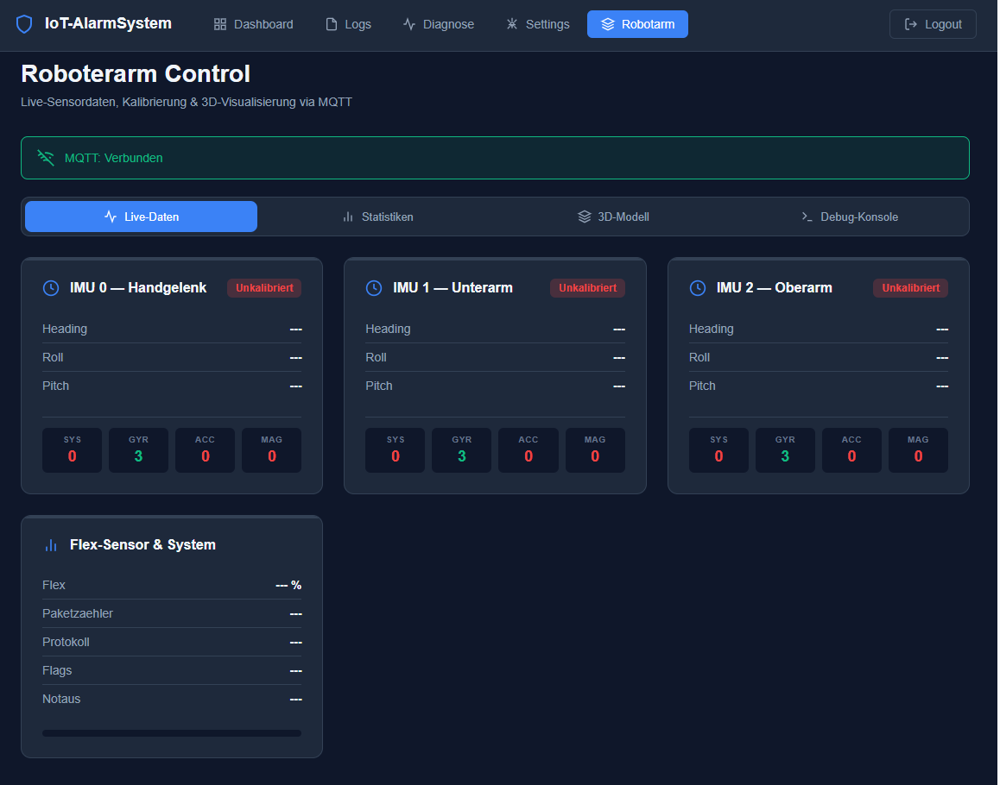
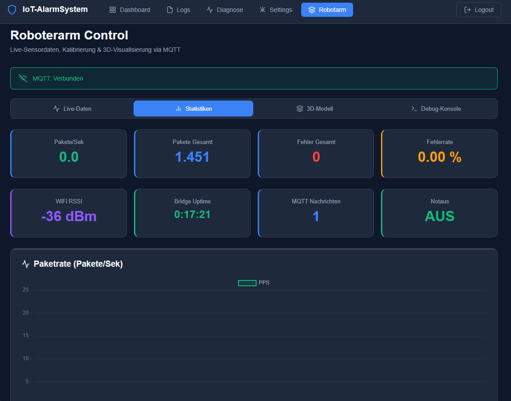
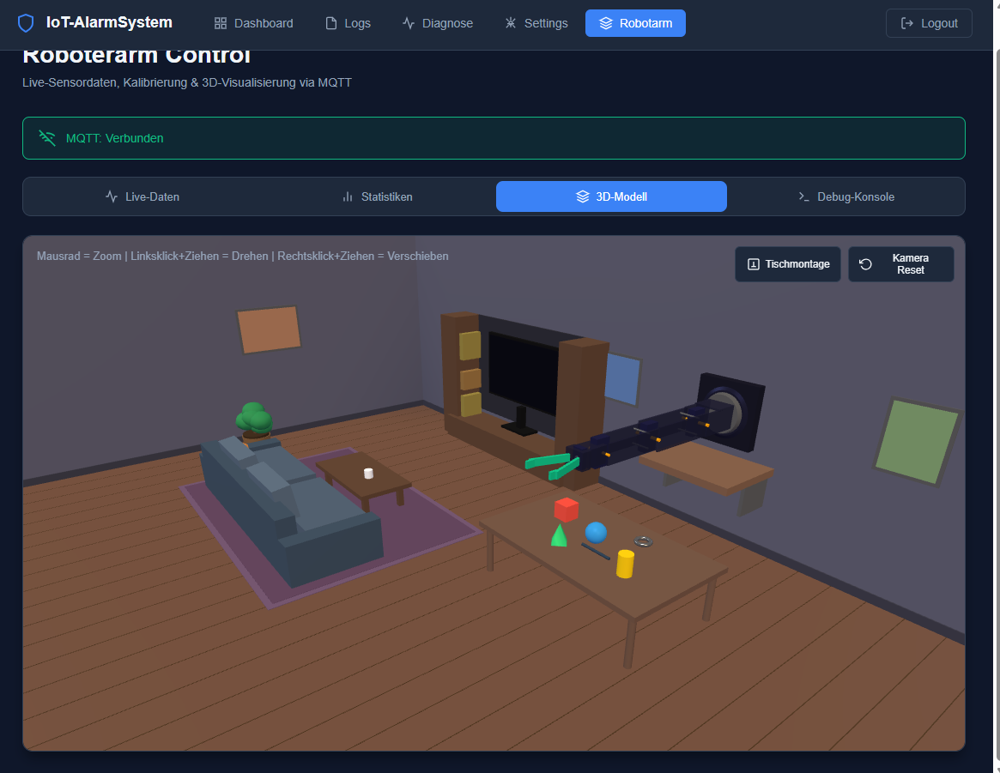
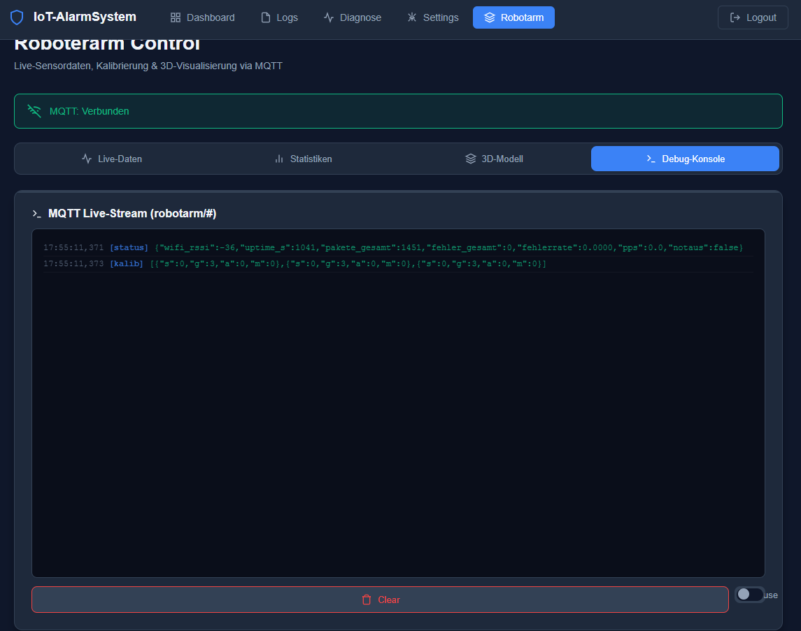

# Dashboard und MQTT-MCP

Dieses Verzeichnis enthaelt den beobachtenden Browser-Twin und den optionalen
MQTT-MCP-Server. Beide nutzen den Debugpfad; sie sind nicht Teil des
sicherheitskritischen Steuerpfads zum realen Arm.

```text
Steuerpfad: Controller --ESP-NOW--> Receiver --I2C--> Arduino --> Servos
Debugpfad:  Controller --ESP-NOW--> Bridge --MQTT--> Dashboard / MCP / ROS 2
```

Ein Ausfall oder eine falsche Anzeige im Debugpfad darf die Armsteuerung nicht
beeinflussen. Der Twin ist ein Diagnosewerkzeug und keine Safety-Freigabe.

## Inhalt

| Pfad | Aufgabe |
| --- | --- |
| `web/views/robotarm.php` | Einbindbares HTML/PHP-Fragment mit vier Unteransichten |
| `web/js/robotarm.js` | MQTT-over-WebSocket, Livewerte, Statistik, Charts und Konsole |
| `web/js/robotarm_3d.js` | Three.js-Szene und Twin-Mapping |
| `web/css/robotarm.css` | Robotarm-spezifische Styles |
| `web/screenshots/` | Screenshots des verifizierten Stands |
| `mcp/mqtt_mcp_server.py` | MCP-Server fuer MQTT-Lesen und optionales Test-Publizieren |
| `mcp/*.template.*` | Vorlagen ohne echte Zugangsdaten |

Die Dateien unter `web/` sind Module des bestehenden IoT Control Centers und
kein eigenstaendiger Webserver.

## MQTT-Schnittstelle

Die Bridge-Firmware publiziert genau diese Topics:

| MQTT-Topic | Inhalt | Verhalten |
| --- | --- | --- |
| `robotarm/imu` | `ImuPaket v4` als JSON | bei jedem validen Bridge-Paket |
| `robotarm/status` | RSSI, Uptime, Paket-/Fehlerzaehler, Rate, Notaus | etwa 1 Hz, retained |
| `robotarm/kalib` | Kalibrierwerte der drei BNO055 | bei Aenderung, retained |
| `robotarm/ota/log` | Start, Erfolg oder Fehler eines Bridge-OTA-Vorgangs | ereignisgesteuert |

Das Dashboard wertet `robotarm/imu`, `robotarm/status` und `robotarm/kalib`
gezielt aus. Seine Konsole zeigt alle abonnierten `robotarm/#`-Nachrichten.

Der IMU-Payload verwendet folgende Kurzschluessel:

| Schluessel | Bedeutung |
| --- | --- |
| `z` | Paketzaehler |
| `s[0..2]` | Hand, Unterarm, Oberarm mit `h`, `r`, `p` |
| `k[0..2]` | BNO055-Status `s`, `g`, `a`, `m` |
| `f` | aktueller Potentiometer-basierter Greiferwert in Prozent |
| `fl` | Flags; Bit 0 ist der Software-Notaus-Status |
| `notaus` | aus Bit 0 abgeleiteter boolescher Anzeigewert |
| `v` | Protokollversion, aktuell `4` |

Wichtig: `/joint_states`, `/robotarm/debug/raw_imu` und
`/robotarm/debug/mapping` sind **ROS-2-Topics**, keine MQTT-Topics. Sie werden
erst lokal von `ros2/` erzeugt und sind nicht im MQTT-WebSocket sichtbar.

## Browser-Modul integrieren

Vorausgesetzt werden ein Mosquitto-WebSocket-Listener hinter `/mqtt`, der
bereits vorhandene Nginx/Webserver und diese Browser-Bibliotheken:

- `mqtt.js` als `window.mqtt`
- `Chart.js` als `window.Chart`
- `Three.js` als `window.THREE`

Vor `web/js/robotarm.js` muss die Host-Anwendung die JavaScript-Globals
`MQTT_WS_USER`, `MQTT_WS_PASS` und `MQTT_WS_TOPICS` definieren. Der verwendete
Broker-Account soll nur `robotarm/#` lesen duerfen. Zugangsdaten gehoeren in
die lokale Serverkonfiguration, nicht in dieses Repository.

Deployment auf dem Pi:

```text
web/views/robotarm.php -> /var/www/html/views/robotarm.php
web/js/robotarm.js     -> /var/www/html/js/robotarm.js
web/js/robotarm_3d.js  -> /var/www/html/js/robotarm_3d.js
web/css/robotarm.css   -> /var/www/html/css/robotarm.css
```

Die Host-Anwendung muss das View-Fragment einbinden, CSS und Skripte laden und
beim Oeffnen des Tabs `raOnTabActivate()` aufrufen. Die `data-click`-Attribute
im Fragment setzen den vorhandenen Event-Dispatcher des IoT Control Centers
voraus. Das Dashboard selbst publiziert keine MQTT-Nachrichten.

## MQTT-MCP-Server

Der MCP-Server laeuft per `stdio` und braucht Python, `paho-mqtt` und das
Python-Paket `mcp`:

```bash
cd dashboard/mcp
python3 -m venv "$HOME/.venvs/robotarm-mcp"
. "$HOME/.venvs/robotarm-mcp/bin/activate"
python3 -m pip install paho-mqtt mcp
cp mqtt_config.template.py mqtt_config.local.py
chmod 600 mqtt_config.local.py
python3 mqtt_mcp_server.py
```

`mqtt_config.local.py` ist gitignoriert. Der Prozess stellt sechs Werkzeuge
bereit:

| Werkzeug | Wirkung |
| --- | --- |
| `mqtt_subscribe` | wartet auf eine konfigurierbare Anzahl Nachrichten |
| `mqtt_read_latest` | liest den letzten lokal empfangenen Wert |
| `mqtt_list_topics` | listet seit Prozessstart beobachtete Topics |
| `mqtt_history` | liest bis zu 100 lokal gepufferte Nachrichten |
| `mqtt_status` | zeigt Verbindung und Empfangsstatistik |
| `mqtt_publish` | publiziert auf beliebige Topics mit Praefix `robotarm/` |

Der MCP-Code ist damit **nicht intrinsisch read-only**. Die mitgelieferte
`mosquitto_acl.template.conf` gibt `mcp_reader` nur Leserechte; dann weist der
Broker Publish-Versuche ab. Falls Test-Publizieren wirklich benoetigt wird,
soll dafuer ein separater Account mit einem engen Test-Topic verwendet werden,
nicht pauschal Schreibrecht auf `robotarm/#`.

`ota_config.template.py` ist derzeit nur eine vorbereitete Vorlage und wird
von `mqtt_mcp_server.py` nicht geladen.

## Twin-Mapping

Dashboard und ROS 2 verwenden denselben Twin-Stand:

| Gelenk | Twin-Eingang |
| --- | --- |
| Basis | `88.9 - S2.pitch`, begrenzt auf `0..100`, visuell `+90..-90` Grad |
| Schulter | negierte Heading-Abweichung von `S2` zu `280.8` Grad |
| Ellbogen | relative Heading-Abweichung `S1` zu `S2` |
| Wrist | negierte relative Roll-Abweichung `S0` zu `S1`, Offset und Stabilisierung |
| Greifer | `f` in `0..100`, geglaettet und auf die visuelle Oeffnung abgebildet |

Der Kollisionssolver ist im aktuellen Dashboard absichtlich deaktiviert, damit
er das direkte Debug-Mapping nicht nachregelt.

Das Mapping des realen Arms in
[`live_i2c_mapping.h`](../firmware/esp32_receiver/live_i2c_mapping.h) ist **nicht
identisch** mit dem Twin: Basisrichtung und Schulterreferenz/-fenster weichen ab;
der Receiver besitzt ausserdem Wrist-Nullung und einen absoluten Roll-Fallback.
Diese Unterschiede koennen Servo- und Visualisierungskoordinaten abbilden und
duerfen nicht durch blindes Kopieren von Konstanten beseitigt werden.

## Start und Funktionscheck

1. Bridge und Mosquitto starten und mit einem nur lesenden Client pruefen, ob
   `robotarm/imu`, `robotarm/status` und `robotarm/kalib` eintreffen.
2. Robotarm-Tab oeffnen. Das Banner muss auf `MQTT: Verbunden` wechseln.
3. Livewerte, Paketzaehler und Notaus-Anzeige gegen einen Roh-Payload abgleichen.
4. Im 3D-Tab jede Achse einzeln bewegen und auf Richtung, Begrenzung und Spruenge
   achten.
5. Fuer den MCP-Pfad zuerst `mqtt_status`, danach `mqtt_read_latest` testen.

Statische Checks aus dem Repository-Root:

```bash
node --check dashboard/web/js/robotarm.js
node --check dashboard/web/js/robotarm_3d.js
python3 -m py_compile dashboard/mcp/mqtt_mcp_server.py
```

## Screenshots

### Live-Daten



### Statistiken



### 3D-Modell



### Debug-Konsole



## Grenzen

- Browser, MCP und ROS sind Debugwerkzeuge und geben keine Bewegungsfreigabe.
- Der angezeigte Notaus ist Telemetrie, keine physische Leistungsabschaltung.
- `mqtt_subscribe` uebergibt der `asyncio.Queue` derzeit blockierende
  Argumente, die diese API nicht akzeptiert. Bis zur Korrektur sind
  `mqtt_read_latest` und `mqtt_history` die belastbaren MCP-Lesepfade.
- Das Repository enthaelt nur das Robotarm-Modul, nicht die komplette
  IoT-Control-Center-Hostanwendung oder deren Nginx-/Mosquitto-Laufzeitdateien.
- Zugangsdaten, lokale Hosts und echte MAC-Adressen bleiben ungetrackt.

Weitere Details stehen in
[`docs/PROTOCOL.md`](../docs/PROTOCOL.md),
[`docs/TESTING.md`](../docs/TESTING.md),
[`SECURITY.md`](../SECURITY.md) und im
[`ROS-2-README`](../ros2/README.md).
